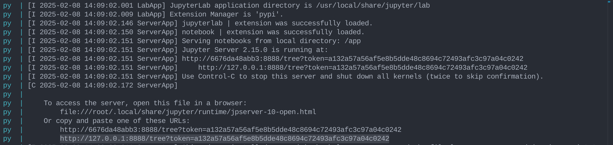

# Tabela de conteúdos

[Instruções para utilizar os scripts de análise](#instruções-para-utilizar-os-scripts-de-análise)

[Detalhes sobre a implementação](#detalhes-sobre-a-implementação)

---------------------------------------

## Instruções para utilizar os scripts de análise

## Requisitos
- Docker

## Instruções

É importante que os comandos abaixo sejam executados na raiz no projeto!

1 - Copiar o arquivo de varíáveis de ambiente e preencher os dados necessários

```
cp .env-example .env
```

2 - Levantar os contêineres
```
./run up
```

3 - Popule o banco de dados

```
./run db:reset
```

4 - Acessar o Jupyter notebook

Acesse o contêiner 'python', espere até que tudo seja instalado e pegue o token de acesso.

```
docker compose logs python
```

Um exemplo de token está destacado abaixo:



Cole o token no campo de URL do navegador

## Detalhes sobre a implementação

### Utilize banco de dados não relacional e jupyter notebook

A base utilizada foi:

Análises de clientes em produtos da Amazon
Base de dados: https://www.kaggle.com/datasets/yasserh/amazon-product-reviews-dataset/data

### Defina a forma de conexão e acesso aos dados no Mongodb

o script 'convert.py' cuida da conversão da base de .csv para .json.
A conexão com o banco é estabelecida dentro de 'config/connection.py' utilizando variáveis de um arquivo .env.

### Implemente os métodos para inserir, editar, buscar e excluir

Os métodos estão contidos no arquivo 'services/mongoServices.py' na classe 'MongoServices'.

- Inserir
método 'insert_document'

- Editar
método 'update_document'

- Buscar
métodos 'read_all', 'filtered_read', 'aggregate'

- Excluir
método delete_document